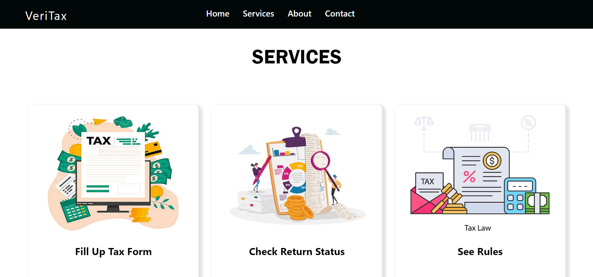

# VeriTax

## Project: VeriTax - Automated Assessment of Your Income Tax Return

Welcome to the VeriTax project repository. This repository contains all the necessary files and documentation related to the VeriTax project for the CSE-326 Information System Design Sessional course.


## Repository Structure

- **[BPMN Diagram](https://github.com/Anonto050/CSE-326-ISD-Sessional/blob/main/BPMN.svg)**
  - This file contains Business Process Model and Notation (BPMN) diagrams for the VeriTax platform.
  - The diagrams illustrate the business processes and workflows involved in the system, helping to visualize the sequence of activities.

- **[Mock UI](https://github.com/Anonto050/CSE-326-ISD-Sessional/blob/main/Group-3Mock-ui-1.pdf)**
  - This file contains mock user interfaces designed for the VeriTax platform.
  - It includes wireframes and prototype designs that help visualize the user experience and interface layout.

- **[Class Diagram and ERD](https://github.com/Anonto050/CSE-326-ISD-Sessional/blob/main/Class%20Diagram%20and%20ERD.pdf)**
  - This file includes the class diagram and Entity-Relationship Diagram (ERD) for the VeriTax system.
  - These diagrams provide a visual representation of the system's data structure and relationships between different entities.

- **[Collaboration Diagram](https://github.com/Anonto050/CSE-326-ISD-Sessional/blob/main/Collaboration%20Diagram.pdf)**
  - This file contains collaboration diagrams that illustrate the interactions between objects in the VeriTax system.
  - The diagrams help understand how objects work together to achieve specific system functions.

- **[Sequence Diagram](https://github.com/Anonto050/CSE-326-ISD-Sessional/blob/main/Sequence%20Diagram.pdf)**
  - This file includes sequence diagrams that show the sequence of messages and interactions between objects in the system.
  - The diagrams provide a detailed view of the order in which operations are carried out.

- **[State Diagram](https://github.com/Anonto050/CSE-326-ISD-Sessional/blob/main/State%20Diagram.pdf)**
  - This file contains state diagrams that depict the different states of the system or objects and the transitions between them.
  - The diagrams help visualize the lifecycle of objects in the VeriTax platform.

## Services of VeriTax



1. **Fill Up Tax Form**
   - Users can fill out their tax forms online through the VeriTax platform, ensuring all necessary fields are completed and calculations are accurate applying OCR.  

2. **Check Return Status**
   - The platform allows users to check the status of their tax returns, providing updates on processing stages and any required actions.

3. **See Rules**
   - Users can access a comprehensive list of tax rules and regulations to ensure compliance and understand their tax obligations. Also can see the rules applicable for his/her tax returns by analyzing them and finding anomalies.

## Project Repositories

- **Frontend Repository:** [VeriTax Frontend](https://github.com/Anonto050/VeriTax-FrontEnd/)
- **Backend Repository:** [VeriTax Backend](https://github.com/risenfromashes/isd-backend)

## Team Members

The VeriTax project is developed by the following team members:

1. `19050005 : Ashrafur Rahman Khan`
2. `1905012 : Faria Moushee`
3. `1905022 : Fatema Tuz Zohra Ava`
4. `1905035 : Farhan Tahmidul Karim `
5. `1905045 : Md Ishrak Ahsan`
6. `1905050 : Riad Ahmed Anonto`
   
## Getting Started

To get started with the VeriTax project, follow these steps:

1. **Clone the Repository**
   ```bash
   git clone https://github.com/Anonto050/CSE-326-ISD-Sessional
   ```

2. **Navigate to the Project Directory**
   ```bash
   cd VeriTax
   ```

3. **Explore the Folders**
   - Navigate through the `BPMN Diagram`, `Mock UI`, `Class Diagram and ERD`, `Collaboration Diagram`, `Sequence Diagram`, and `State Diagram` files to explore the content and documentation.

## Contribution Guidelines

- Follow the standard Git workflow for contributing to this project.
- Ensure that your code is well-documented and adheres to the project's coding standards.
- Submit pull requests for any new features or bug fixes, and include a detailed description of your changes.

## Support

If you have any questions or need further assistance, please reach out to the project team.

---

Thank you for your interest in the VeriTax project. We hope this repository provides you with all the information you need to understand and contribute to our project.
